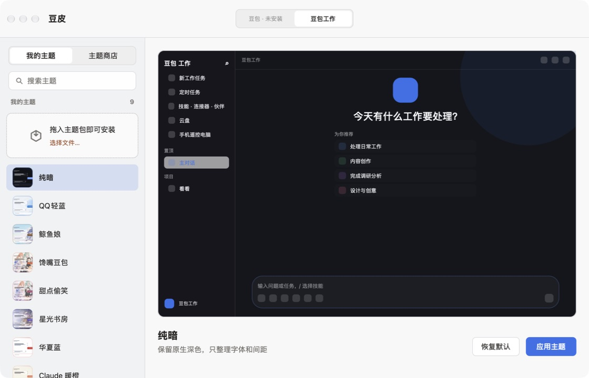
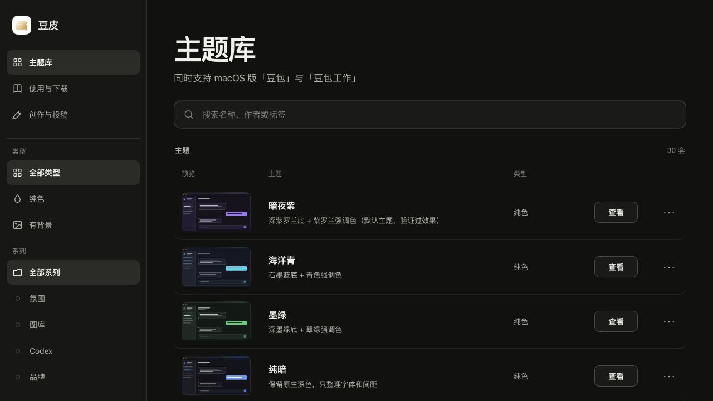
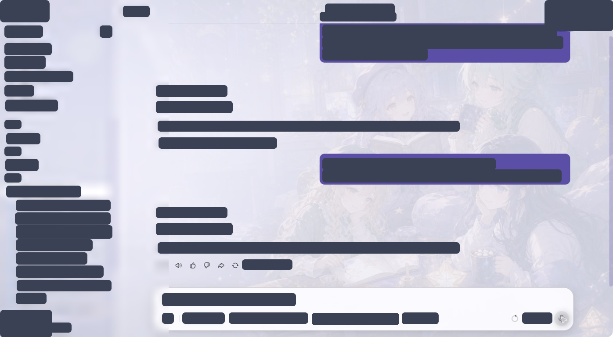

<div align="center">

[简体中文](README.md) · [English](README.en.md)


# Doubao Skin

**A native theme manager for Doubao and Doubao Work on macOS, with experimental WorkBuddy support.**

[Theme gallery](https://doubao-skin.idevlab.dev) · [Guide & downloads](https://doubao-skin.idevlab.dev/guide#download) · [Create & contribute](https://doubao-skin.idevlab.dev/contribute)

[](https://github.com/IchenDEV/doubao-skin/actions/workflows/ci.yml)
[](https://doubao-skin.idevlab.dev)
[](LICENSE)

</div>





> macOS is supported today; Windows is planned. This is an independent project, not an official Doubao or WorkBuddy product, and it does not modify official app bundles in `/Applications`.

## Real transformed pages

These screenshots were captured from a real local Doubao Work window with themes applied in live mode. Only the author's avatar and identity, company name, and computer device name are redacted; the rest of the interface and content is unchanged. The unredacted captures are not included in the repository.

<table>
  <tr>
    <td width="50%">
      
      <br><sub>QQ Light Blue · Real conversation</sub>
    </td>
    <td width="50%">
      
      <br><sub>Starry Room · Conversation view</sub>
    </td>
  </tr>
</table>

## Features

- Native macOS app for browsing, previewing, installing, applying, and restoring themes.
- 30 built-in themes across solid colors, atmospheric backgrounds, editor palettes, and brand-inspired styles.
- Online theme store with verifiable `.doubao-skin.zip` packages.
- Universal ZIP and DMG packages for both Apple Silicon and Intel Macs.
- One Rust toolchain shared by the desktop app, CLI, Codex plugin, and Claude Code plugin.
- Live injection and offline-clone modes while the official app bundle remains untouched.
- Experimental WorkBuddy 5.3.14 support: v2 themes use compatibility mode, while v3 themes load only when `targets.workbuddy` is declared. WorkBuddy remains live-mode only, without protocol-bridge or offline-clone support.
- Responsive website with compound filters, dark mode, theme details, guides, and contribution documentation.
- One layered yuba identity shared by the desktop app and website, with default, dark, and monochrome system appearances.

## Download and use

Download the latest build from [GitHub Releases](https://github.com/IchenDEV/doubao-skin/releases/latest):

- `Doubao-Skin-macOS-universal.dmg`: recommended; open it and drag the app to Applications.
- `Doubao-Skin-macOS-universal.zip`: unzip and run directly.
- `.sha256`: SHA-256 checksums for each package.

If macOS blocks the first launch, go to **System Settings → Privacy & Security**, scroll down to “Security”, click **Open Anyway**, and enter your admin password.

Release packages use one continuous community self-signed certificate. They are not Apple-notarized; future versions retain this signing identity unless an announced security rotation is required.

1. Open Doubao Skin.
2. Choose Doubao, Doubao Work, or experimental `WorkBuddy` (`Command-1`, `Command-2`, and `Command-3` also switch targets).
3. Pick a theme and review the preview.
4. Select **Apply Theme**. Use **Restore Default** to undo it.

WorkBuddy has been verified with version 5.3.14. If it is already running without local debugging enabled, the first Apply action explains the impact and changes to **Restart and Apply**; only that second explicit action may quit and restart WorkBuddy. Save any in-progress work first. If WorkBuddy is later quit by the user, Doubao Skin does not relaunch it.

The in-app store installs remote themes directly. You can also drag a local package into the window or import one with **Install Theme…** / `Command-O`. Installed themes live in `~/Library/Application Support/Doubao Skin/themes/`.

## Themes

Browse and filter every theme at [doubao-skin.idevlab.dev](https://doubao-skin.idevlab.dev). The current set contains 30 themes:

- **Solid and editor palettes:** Violet Night, Ocean Cyan, Forest, Pure Dark, Peach Sunset, Huaxia Blue, plus Catppuccin, Dracula, Nord, Gruvbox, Solarized, and One Half adaptations.
- **Atmospheric backgrounds:** Gothic Void, Sakura Night, Cyber Neon, Mist Forest, Cozy Room, Neon Koi, Moon Pine, Crimson Rain, and Machine Overseer.
- **Bright and brand-inspired:** QQ Light Blue, Whale Maid, Tea Party, Flower Club, Starry Room, Snack Giggle, Dessert Giggle, GitHub Repository, and Claude Warm.

Asset provenance and licenses are recorded in each `theme.json`, the [theme research notes](design/theme-standard/codex-theme-research.md), and [third-party notices](THIRD_PARTY_NOTICES.md).

## Agent plugins

The repository is a Marketplace for both Codex and Claude Code. Installing it provides `$create-doubao-theme` and `$apply-doubao-theme`.

Codex:

```bash
codex plugin marketplace add IchenDEV/doubao-skin
codex plugin add doubao-skin@doubao-skin
```

Claude Code:

```text
/plugin marketplace add IchenDEV/doubao-skin
/plugin install doubao-skin@doubao-skin
```

- `$create-doubao-theme`: create, validate, preview, and package a theme from natural language.
- `$apply-doubao-theme`: list, install, apply, restore, and manage themes.

Plugin sources are under [`plugins/doubao-skin`](plugins/doubao-skin). The website also publishes an [Agent Skills Discovery Draft 0.2.0 index](https://doubao-skin.idevlab.dev/.well-known/agent-skills/index.json).

## Rust CLI

`doubao-theme` is a standalone command-line tool that does not depend on Node.js, Python, or GPUI.

### Install

One-line install (macOS only):

```bash
curl -fsSL https://raw.githubusercontent.com/IchenDEV/doubao-skin/main/scripts/install-cli.sh | sh
```

The script downloads the prebuilt universal binary from GitHub Releases, verifies its checksum, and places it in `/usr/local/bin`. Set `INSTALL_DIR` to choose a different location, or `VERSION` to pin a specific release:

```bash
VERSION=v0.1.0 INSTALL_DIR=~/.local/bin curl -fsSL https://raw.githubusercontent.com/IchenDEV/doubao-skin/main/scripts/install-cli.sh | sh
```

You can also download `doubao-theme-macOS-universal.tar.gz` from [GitHub Releases](https://github.com/IchenDEV/doubao-skin/releases/latest) and extract it manually.

### Usage

```bash
doubao-theme list
doubao-theme create themes/my-theme \
  --name "My Theme" --description "A calm dark theme" \
  --accent "#5b7ee5" --appearance both --author "Local user"
doubao-theme check themes/my-theme
doubao-theme preview themes/my-theme
doubao-theme pack themes/my-theme dist/my-theme.doubao-skin.zip
```

Additional commands include `install`, `apply`, `restore`, `build`, and `remove-build`. Run `doubao-theme --help` for the complete interface.

## Build from source

Requirements: macOS, Rust 1.97.1+, Node.js 24.19+, and pnpm 12.

```bash
# Test and validate the whole project
./scripts/check.sh all

# Run the desktop app
cargo run -p doubao-skin-desktop

# Build for the host architecture
./scripts/build-macos.sh

# Build a universal Apple Silicon + Intel package
./scripts/build-macos.sh --universal
```

Website:

```bash
corepack pnpm --dir apps/web install --frozen-lockfile
corepack pnpm --dir apps/web sync
corepack pnpm --dir apps/web dev
```

`sync` generates the SQLite catalog, normalized previews, store JSON, and installable theme packages from `themes/`. Do not edit `apps/web/data` or `apps/web/public/themes` by hand.

## Repository layout

```text
apps/desktop        Native GPUI desktop app
apps/web            Next.js theme gallery
crates/skin-core    Theme engine, CLI, live/offline builds, and protocol bridge
themes              Built-in themes and assets
plugins             Codex and Claude Code plugins
design              Theme schema and design rules
docs                Architecture, development, contribution, release, and deployment docs
workflow            Artifact-driven delivery and verification records
```

## Create and contribute themes

Use `doubao-theme create` or `$create-doubao-theme` to generate a `schemaVersion: 3` theme, and declare its Doubao, DoubaoWork, and WorkBuddy scope with `--targets`. See the [theme standard](design/theme-standard/README.md), [v3 multi-host guide](design/theme-standard/theme-v3.md), and [v3 JSON schema](design/theme-standard/theme-v3.schema.json). Existing v1/v2 user themes remain readable.

Before opening a pull request:

```bash
cargo run -p skin-core --bin doubao-theme -- check themes/my-theme
corepack pnpm --dir apps/web sync
./scripts/check.sh all
```

Follow [Submitting a theme](docs/submitting-themes.md) and the [contribution guide](CONTRIBUTING.md). The website does not accept direct uploads; themes are submitted through GitHub pull requests.

## Website deployment

`apps/web` runs on Vercel at [doubao-skin.idevlab.dev](https://doubao-skin.idevlab.dev). Once the GitHub repository is connected to the existing Vercel project, pushes to `main` deploy to Production while other branches and pull requests receive Preview deployments. See [Website deployment](docs/website-deployment.md) for configuration and acceptance checks.

## Documentation

- [Documentation index](docs/README.md)
- [Architecture](docs/architecture.md)
- [Local development](docs/development.md)
- [Development workflow](docs/development-workflow.md)
- [macOS releases](docs/releasing.md)
- [Security policy](SECURITY.md)

## License

The Rust core, website, project documentation, and original theme definitions are available under the [MIT License](LICENSE). Third-party assets and dependencies remain subject to [THIRD_PARTY_NOTICES.md](THIRD_PARTY_NOTICES.md) and the matching files under `LICENSES/`.
